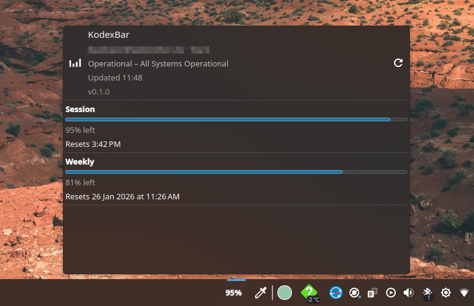

# KodexBar (KDE Plasma 6 widget)

A lightweight Plasma 6 applet that wraps the `codexbar` CLI and shows your Codex usage (session, weekly, etc.) directly in the panel. Click the panel item to open a detailed popup with progress bars and reset times.

Upstream project: [`codexbar`](https://github.com/steipete/CodexBar) (`https://github.com/steipete/CodexBar`)



## Feature status (vs CodexBar macOS)

✅ Implemented
- Usage overview with progress bars (session, weekly, and any other periods returned by the CLI)
- Reset times shown verbatim
- Account, plan, and status in the header
- Manual refresh button + right‑click “Refresh”
- Configurable command and refresh interval

❌ Not implemented
- Provider tabs (Claude, GPT, etc.)
- Extra usage / cost history
- Account switching
- Status page / dashboard links
- Settings like themes, graphs, or advanced analytics

## Requirements
- **KDE Plasma 6** (tested on Fedora 43, Plasma 6.5)
- **codexbar CLI** (https://github.com/steipete/CodexBar) installed and available in `PATH` 
  - Example command used by default:
    - `codexbar usage --status --provider codex --source cli`

## Install
From this repo root:

```
./install.sh
```

Then add the widget from the Plasma “Add Widgets” menu.

## Update after changes
```
./update.sh
```

If the widget doesn’t refresh visually after an update:

```
kquitapp6 plasmashell && plasmashell --replace
```

Then remove/re‑add the widget once.

## Configure
Right‑click the widget → **Configure…**

Settings:
- **Command**: override the CLI command (if your CLI is named differently or you want another provider/source).
- **Refresh interval**: polling interval in seconds (minimum 10s).

## Development notes
- QML lives in `contents/ui/main.qml`.
- Settings live in:
  - `contents/config/config.qml`
  - `contents/config/main.xml`
  - `contents/ui/configGeneral.qml`
- The widget uses `Plasma5Support.DataSource` to run the CLI every interval.
- CLI output is parsed in QML; `Resets …` lines are preserved as-is.

## Versioning
- The widget version is stored in `metadata.json` and is shown in the popup header as “Widget vX.Y.Z”.
- Release notes live in `CHANGELOG.md`.

## Troubleshooting
- **Widget doesn’t show output**: run the CLI manually to confirm it works:
  - `codexbar usage --status --provider codex --source cli`
- **Library warnings (libcurl)** are ignored in the UI.
- **Panel item looks squished**: reduce panel content or remove other expanding applets. The widget shows only the session percentage in the panel to stay compact.

## License
MIT (see `metadata.json`).
